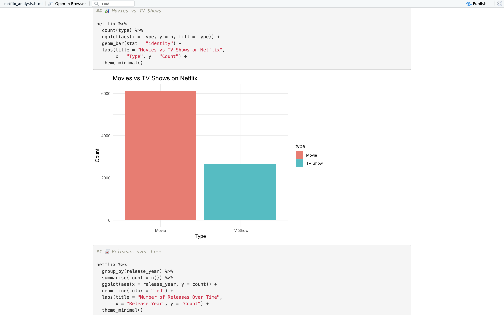
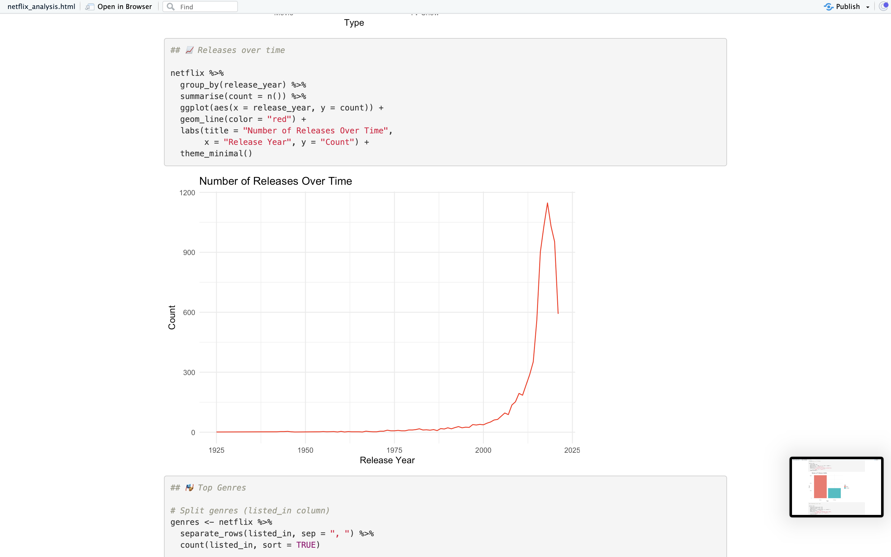
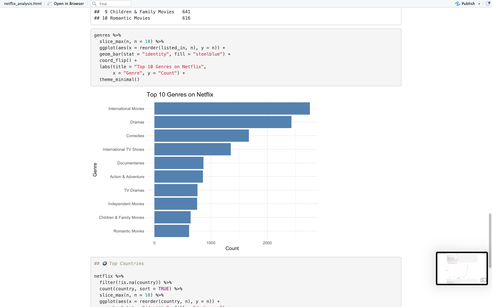
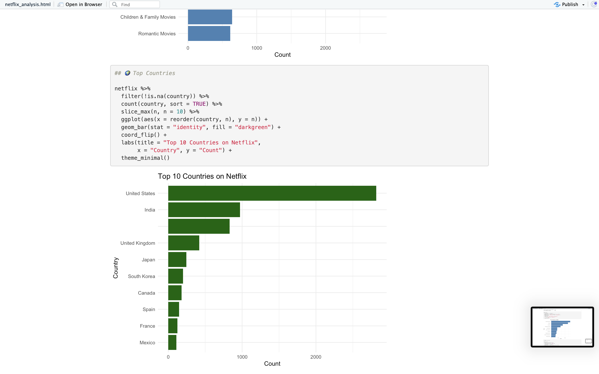

# 🎬 Netflix Data Analysis

This project explores the Netflix dataset to uncover insights about movies and TV shows, their distribution over time, popular genres, and top producing countries.

## 📂 Project Structure
```
netflix-analysis/
│── data/
│    └── netflix_titles.csv
│── notebooks/
│    └── netflix_analysis.Rmd
│── assets/
│    ├── movies-vs-tvshows.png
│    ├── releases-trend.png
│    ├── top-genres.png
│    └── top-countries.png
└── README.md
```

## 🚀 Features
- Analysis of **Movies vs TV Shows**
- Release trends over the years
- Top 10 most common genres
- Top 10 countries producing Netflix content
- Interactive analysis in R Markdown

## 📊 Results

### Movies vs TV Shows


### Releases Over Time


### Top 10 Genres


### Top 10 Countries


## 🛠️ Tech Stack
- **R** (tidyverse, ggplot2, plotly, sqldf, here)
- **RStudio** (R Markdown for reporting)
- **Git/GitHub** for version control

## 📈 Next Steps
- Add interactive plots with Plotly  
- Deploy analysis as a Shiny dashboard  
- Automate dataset refresh with GitHub Actions  

---

👩‍💻 Author: **Jelena Vucetic**  
📅 Date: 2025-09-21
